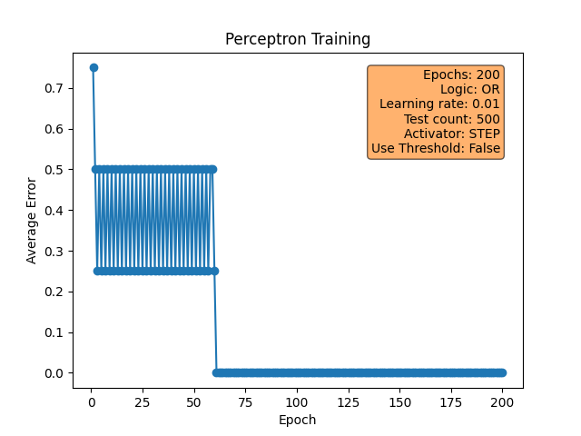

# It all started with the perceptron
Building a neural network can literally be done in a few lines of code. However, this is with the help of fabulous libraries that take away all of the heavy lifting for you. Building something from scratch arms you with the knowledge you need to understand how these things work. Let's start with a simple example, a single perceptron neural network.

We'll also look at XOR a little later and the problems this presents. 

## What is our goal?
The aim is to predict the logical outcome for two bits using either an AND or an OR operation. The table shows the outcome for each combination of A and B, firstly using AND and then using OR. We also show XOR (exclusive OR) - more on this later.

| A | B | AND | OR | XOR |
| --- | --- | --- | --- | --- |
| 0 | 0 | 0 | 0 | 0 |
| 0 | 1 | 0 | 1 | 1 |
| 1 | 0 | 0 | 1 | 1 |
| 1 | 1 | 1 | 1 | 0 |

- The outcome of and AND operation is 1 only when A and B are both 1.
- The outcome of and OR operation is 1 when either A or B is 1.
- The outcome of and XOR operation is 1 when only when A and B are different to each other.

## What does our perceptron look like?
The [`perceptron.py`](perceptron.py) file defines a class called Perceptron - this has 2 inputs (representing A and B from our table) and a single output - this will be a prediction for  A AND B or for A OR B. I wrote a [Medium article](https://medium.com/ai-mind-labs/perceptron-101-the-building-blocks-of-a-neural-network-496f6b9b3826) that describes the Perceptron in more detail if you need it.

The image shows a perceptron with 4 inputs, for our scenario, there are only 2.

## The process in a nutshell
- We create a new Perceptron and specify if we want it to learn the AND or OR operation.
- We also specify the number of epochs (how many steps of training to apply), the learning rate (how quickly or slowly the weights of the Perceptron are adjusted) and the type of activation function to use.
- The perceptron trains itself using the data shown in the table above and also provides a visual for how the training progressed.
- Once trained, we can ask the Perceptron to predict a logical output for two inputs A and B.
- The app does this many times and reports how successul it was.

## What happens during training?
- We expect the errors between predicted and actual values for A AND B or A OR B to decrease over time. The decrease in errors depends on the parameters we use, especially the activator function and the learning rate. While each training process is different, a few examples are provided here. The plot legend shows what parameters were used during training.

